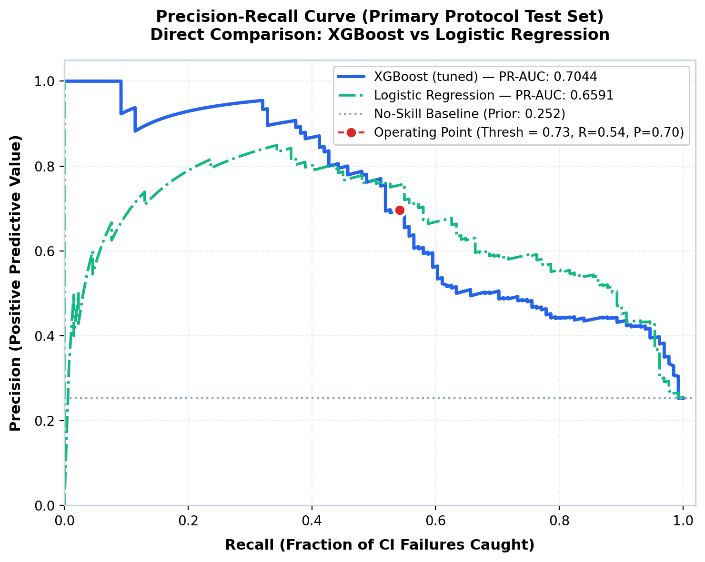
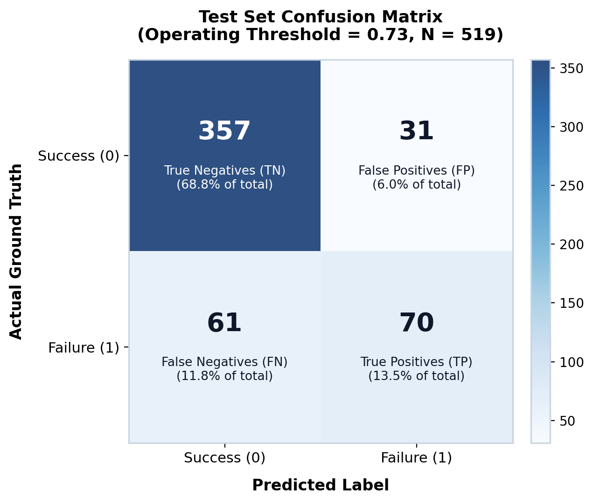
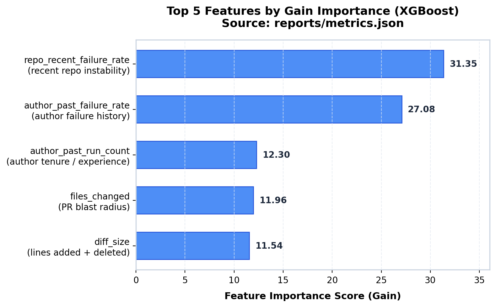

# CI Failure Predictor

> **Project History**: See [HISTORY.md](HISTORY.md) for a full account of what was built, key issues found and fixed along the way, and the reasoning behind major methodology decisions.

## Overview

CI Failure Predictor predicts whether a GitHub Actions CI workflow run will fail using metadata available at pull request open time (before the build executes). The system focuses on leak-free evaluation using time-ordered splits, real metrics (PR-AUC, recall), and deployment via a live FastAPI inference service integrated with a GitHub Action.

## How It Works

The system operates across four core components:

- **Data Pipeline**: Collects GitHub Actions workflow run history and pull request metadata, computing leak-free historical features (time-shifted rolling failure rates, author past performance, and PR-level diff statistics).
- **Model**: Tuned XGBoost classifier trained using per-repository time-series cross-validation, evaluated against multiple baseline models with paired bootstrap significance testing.
- **Serving**: A FastAPI inference service exposing `/predict` and `/health`, computing real-time failure risk probabilities alongside per-request SHAP-based risk factor attributions.
- **GitHub Integration**: A GitHub Actions workflow that scores pull requests live on open or update, posting and maintaining a sticky risk assessment comment on the PR thread.

## Setup & Quickstart

### GitHub Token Setup

To collect workflow run and pull request metadata without running into tight unauthenticated rate limits:
1. Go to GitHub -> **Settings** -> **Developer settings** -> **Personal access tokens** -> **Tokens (classic)** (or visit `https://github.com/settings/tokens`).
2. Click **Generate new token** -> **Generate new token (classic)**.
3. Provide a note (e.g. `ci-failure-predictor`).
4. **Scopes**: For public repositories, **no special scopes are required** (leave all checkboxes unchecked).
5. Generate the token and copy its value.

### Environment Configuration

Copy `.env.example` to `.env` and fill in your token and target repositories:

```bash
cp .env.example .env
```

Edit `.env`:
```env
GITHUB_TOKEN=ghp_your_personal_access_token_here
TARGET_REPOS=owner/repo1,owner/repo2
```

### Installation

Install the project dependencies using pip:

```bash
pip install -r requirements.txt
```

*(On Windows: `py -m pip install -r requirements.txt`)*

### Data Collection

Run the data collection script to fetch workflow runs and PR metadata for configured repositories:

```bash
python -m src.collect.run_collection
```

To bypass cached responses under `data/raw/` and force fresh API downloads, use the `--force` flag:

```bash
python -m src.collect.run_collection --force
```

### Feature Engineering

Process raw workflow runs and PR metadata into labeled, leak-free feature tables under `data/processed/combined_features.parquet`:

```bash
python -m src.features.run_build_features
```

### Baseline Models

Fit and evaluate the 5 baseline models across chronological splits:
1. Dummy Classifier (class prior)
2. Repo-Prior Classifier (training failure rate per repository)
3. Recent-Rate Heuristic (raw recent failure rate feature)
4. Decision Stump (depth 1, balanced weights, out-of-fold threshold tuning)
5. Logistic Regression Pipeline (log1p transform -> StandardScaler -> balanced LogisticRegression)

The runner evaluates models under two split protocols:
- **`per_repo` (Primary)**: Chronological 80/20 split applied independently within each repository, ensuring balanced multi-repo representation without cross-repo time confounding.
- **`global` (Secondary)**: Single chronological 80/20 cutoff across all pooled runs.

Run the evaluation script:

```bash
python -m src.modeling.run_baselines
```

Evaluation metrics, diagnostic summaries, and paired bootstrap comparisons are automatically generated and saved to `reports/baselines.json`.

### Train XGBoost

Tune XGBoost hyperparameters via 5-fold per-repository time-series cross-validation (`per_repo_time_series_cv`), fit the final model on the primary train set, evaluate against baselines and Logistic Regression under both split protocols, and serialize the fitted model:

```bash
python -m src.modeling.run_xgboost
```

The final model artifact is serialized to `src/modeling/model.pkl` along with `src/modeling/model_metadata.json`, and comprehensive evaluation metrics and paired bootstrap tests are saved to `reports/metrics.json`.

### Generate Report Figures

Generate visualization artifacts from the serialized model and evaluation metrics:

```bash
python -m src.modeling.generate_report_figures
```

Saved figures are stored under `reports/figures/`:
- `confusion_matrix.png`
- `feature_importance.png`
- `pr_curve.png`

### Running Tests

Run the test suite using pytest:

```bash
pytest tests/
```

### Run the Inference API

Serve the tuned XGBoost model at its calibrated operating threshold (0.73) via FastAPI:

```bash
uvicorn src.service.main:app --reload
```
*(On Windows: `py -m uvicorn src.service.main:app --reload`)*

Interactive OpenAPI documentation is available at `http://127.0.0.1:8000/docs` and healthcheck at `http://127.0.0.1:8000/health`.

#### Sample Prediction Request (curl)

```bash
curl -X POST http://127.0.0.1:8000/predict -H "Content-Type: application/json" -d '{"diff_size": 250, "files_changed": 8, "test_files_changed": 0, "touches_test_files": false, "time_of_day": 23, "day_of_week": 5, "is_weekend": true, "author_past_run_count": 3, "author_past_failure_rate": 0.6, "repo_recent_failure_rate": 0.4}'
```

#### Actual Returned JSON Response

```json
{
  "failure_risk_score": 0.7128,
  "risk_label": "medium",
  "top_risk_factors": [
    {
      "feature": "repo_recent_failure_rate",
      "contribution": 0.8071
    },
    {
      "feature": "author_past_failure_rate",
      "contribution": 0.6528
    },
    {
      "feature": "author_past_run_count",
      "contribution": 0.2893
    }
  ],
  "model_version": "1.0.0-xgb"
}
```

## GitHub Action Integration

The repository includes an automated GitHub Actions workflow defined in [.github/workflows/failure-risk-score.yml](file:///c:/Users/sriva/Desktop/ci-failure-predictor/.github/workflows/failure-risk-score.yml) that scores pull requests on open or update (`pull_request: [opened, synchronize]`) and maintains an up-to-date risk assessment comment on the PR thread.

### How It Works Step-by-Step

1. **Trigger & Environment**: Triggers on `pull_request` events (`opened`, `synchronize`), checks out code, and prepares Python 3.11 dependencies.
2. **Service Startup**: Launches the FastAPI inference microservice in the background, polling `GET /health` with a 30-second timeout until ready.
   *(Note: Starting uvicorn directly inside the Action job is a self-contained demonstration pattern for testing and CI validation without external dependencies. In production, the step points to a hosted microservice).*
3. **Live Leak-Free Feature Extraction**: Calls `src/features/compute_live_features.py` using the current timestamp (`datetime.now(timezone.utc)`) as the strict historical cutoff. This captures newly finished CI runs on multi-commit PRs while preventing future outcome leakage.
4. **Model Scoring & Plain-Language Attribution**: Calls `/predict` via `src/service/score_pr.py`, translating technical feature keys into readable developer explanations and generating `risk_comment.md`.
5. **Sticky Comment Update**: Uses `actions/github-script@v7` to search existing comments for the sticky anchor `<!-- ci-failure-predictor-comment -->`. If a bot comment exists from a previous push, it updates it in-place; otherwise, it creates a new comment.

### Local Dry Run (Auto-Discovered Open PR)

You can execute a live dry run locally against any repository without specifying a PR number. The CLI auto-discovers the latest open pull request:

```bash
python -m src.service.score_pr --owner tiangolo --repo fastapi --output-file risk_comment.md
```

#### Example Output on Live PR (`tiangolo/fastapi` PR #16374)

**Computed Feature Dict:**
```json
{
  "diff_size": 50,
  "files_changed": 2,
  "test_files_changed": 1,
  "touches_test_files": true,
  "time_of_day": 11,
  "day_of_week": 4,
  "is_weekend": false,
  "author_past_run_count": 5,
  "author_past_failure_rate": 0.2,
  "repo_recent_failure_rate": 0.3
}
```

**Prediction Response:**
```json
{
  "failure_risk_score": 0.6551,
  "risk_label": "medium",
  "top_risk_factors": [
    {
      "feature": "repo_recent_failure_rate",
      "contribution": 0.8603
    },
    {
      "feature": "author_past_failure_rate",
      "contribution": 0.059
    },
    {
      "feature": "author_past_run_count",
      "contribution": 0.0467
    }
  ],
  "model_version": "1.0.0-xgb"
}
```

**Generated Comment Preview (`risk_comment.md`):**
```markdown
<!-- ci-failure-predictor-comment -->
## 🔍 CI Failure Risk Assessment for #16374

🟡 **MEDIUM RISK** — Predicted Failure Risk: **65.5%** *(Operating Threshold: 73.0%)*

> ℹ️ **Moderate risk profile**: Failure likelihood is within typical operational bounds. Standard automated checks apply.

### Top Contributing Factors
1. **Recent CI instability in this repository** (`repo_recent_failure_rate`) (Value: `0.3`) — Contribution: `+0.8603`
2. **Author's historical CI failure rate** (`author_past_failure_rate`) (Value: `0.2`) — Contribution: `+0.0590`
3. **Author's prior CI run experience in this repository** (`author_past_run_count`) (Value: `5`) — Contribution: `+0.0467`

---
*Evaluated by [ci-failure-predictor](https://github.com/sritva/ci-failure-predictor) (Model Version: `1.0.0-xgb`) at PR-open time.*
```

## Results

Evaluation on the held-out primary test set (519 runs, 131 failures across 8 repositories under `per_repo_time_split`):

- **XGBoost (tuned)**: **0.7044 PR-AUC** (95% Bootstrap CI: `[0.6251, 0.7745]`, ROC-AUC: `0.8439`, F1: `0.6034` at threshold `0.73`)
- **Logistic Regression**: **0.6591 PR-AUC** (95% Bootstrap CI: `[0.5789, 0.7597]`, ROC-AUC: `0.8647`, F1: `0.6498` at threshold `0.62`)
- **Paired Bootstrap Comparison (1,000 resamples)**:
  - Mean PR-AUC difference (XGBoost - LR): **+0.0379**
  - 95% Bootstrap CI: **[-0.0223, +0.0976]**
  - XGBoost win fraction: **88.3%**

> [!NOTE]
> While XGBoost achieves the highest headline PR-AUC (0.7044) and outperforms Logistic Regression in 88.3% of paired bootstrap resamples, the 95% bootstrap confidence interval for the difference spans zero (`[-0.0223, +0.0976]`). This indicates a moderate performance advantage rather than a statistically decisive blowout. Logistic Regression captures ~94% of XGBoost's ranking quality while offering simpler explainability and lower latency. Both models strongly outperform the single-feature Recent-Rate Heuristic (PR-AUC 0.5020) and static Repo-Prior baseline (PR-AUC 0.3887).

### Evaluation Figures

#### Precision-Recall Curve (Primary Protocol)


#### Confusion Matrix (Threshold = 0.73)


#### Top 5 Features by Gain Importance


